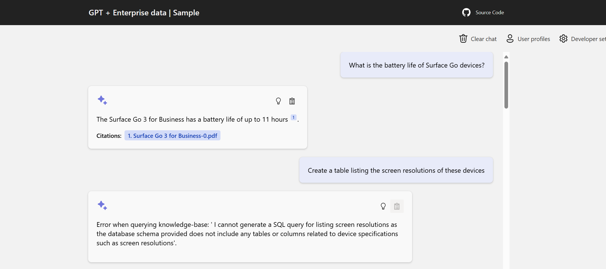
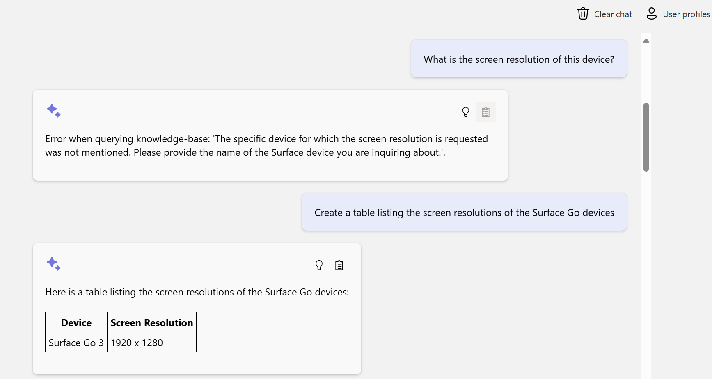
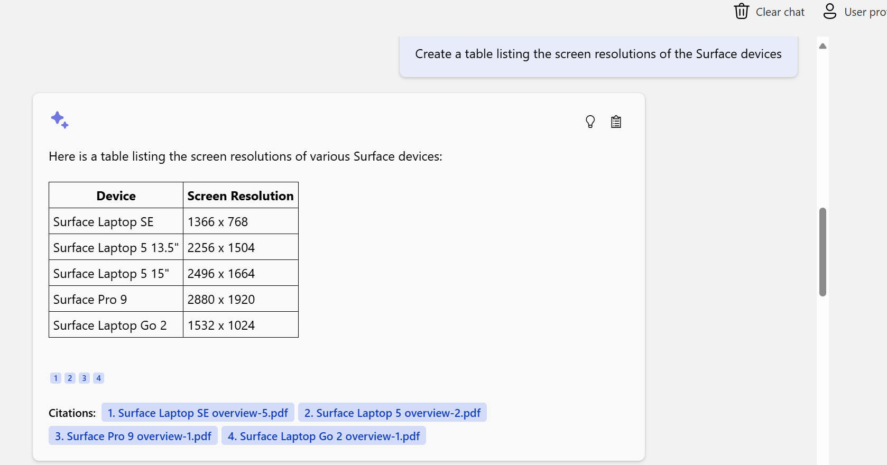
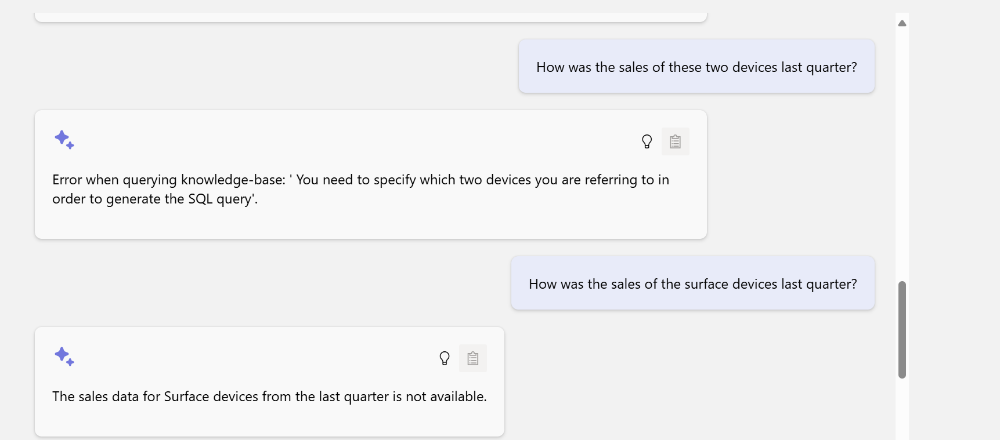
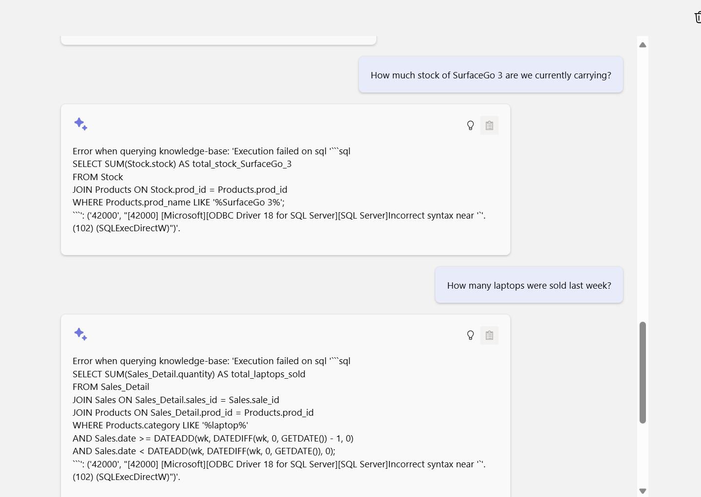
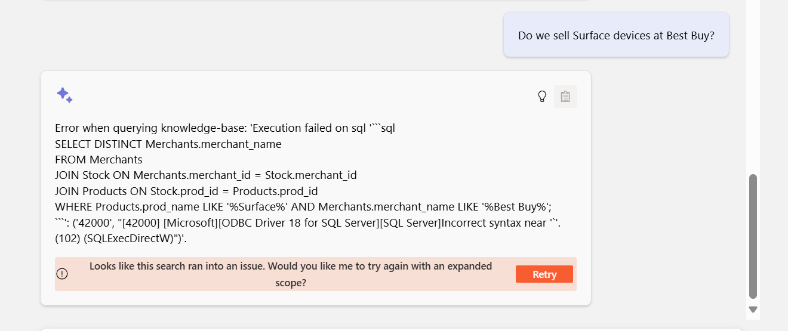

Screenshots of a basic NL2SQL solution.  

I can provide the working code for this solution.  

As a setup, the goal is:  _we have an agent that is able to take natural language questions and construct syntatically-correct SQL that is executed against our database_.  

I have:

* a collection of pdfs about Surface devices
* a sales database of sales about those devices.  

The _agent_ decides whether to query the pdfs or the sales db.  Some notes:  

* I purposefully make the SQL "echo" to the screen
* It _does_ get confused when I mention "table", it thinks I should query a db.  This is simple enough to fix within the prompt, but I didn't do this so you could see the issue.  

