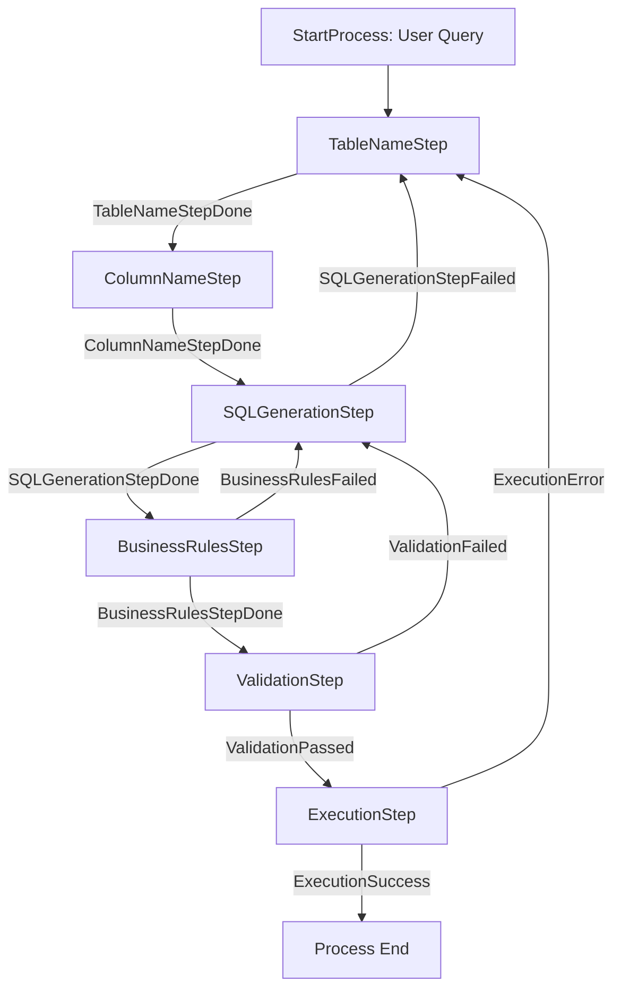
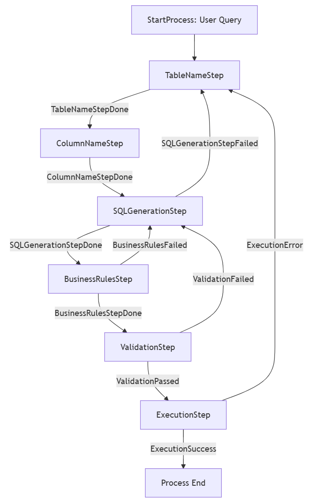

We will use Semantic Kernel to build out a full NL2SQL agentic solution.  



The code for the implementation looks like this:  

```python
def get_sql_process(self) -> KernelProcess:
    """Build and configure the SQL generation process with all steps and their transitions."""
    process = ProcessBuilder(name="SQLGenerationProcess")

    # Add steps to the process
    table_step = process.add_step(TableNameStep)
    column_step = process.add_step(ColumnNameStep)
    sql_generation_step = process.add_step(SQLGenerationStep)
    business_rules_step = process.add_step(BusinessRulesStep)
    validation_step = process.add_step(ValidationStep)
    execution_step = process.add_step(ExecutionStep)

    # Define the process flow
    process.on_input_event(event_id=SQLEvents.StartProcess).send_event_to(target=table_step, parameter_name="data")
    
    table_step.on_event(event_id=SQLEvents.TableNameStepDone).send_event_to(
        target=column_step, parameter_name="data"
    )
    
    column_step.on_event(event_id=SQLEvents.ColumnNameStepDone).send_event_to(
        target=sql_generation_step, parameter_name="data"
    )
    
    # ...additional event flow definitions...

    return process.build()
```

The workflow: 

1. The process starts by identifying tables
2. On successful table identification, it moves to column identification
3. With tables and columns identified, it generates SQL
4. The SQL undergoes business rule validation
5. Then syntax validation
6. Finally, execution if all validations pass



As with everything else in Generative AI, the prompts are the key.  An example prompt looks something like this (you can look at the code directly to see the actual prompt):  

```python
get_table_names_prompt_template = """
## Instructions:
You are an advanced SQL query generator. Your task is to extract the relevant table names using the following **natural language question** from a list of business tables. 

You **MUST** take a conservative approach: if in doubt whether a table is relevant or not, then you need to include it in the list. It is better to have it and not need it than to need it and not have it. Make sure to review the Business Rules when deciding on the table names.

Make sure to include all foreign keys and relationships that are relevant to the user's question that are necessary to join the tables. If the tables do not have direct relationships, please analyze the situation and include any intermediary tables that can join the tables, and might be necessary to answer the user's question.

## **Business Rules**
{rules}

## User Query
{user_query}

## START OF LIST OF TABLES
{table_list}
## END OF LIST OF TABLES

# **Inputs from previous generation rounds**
...
"""
```

## Process to get Running Quickly Using My Healthcare SQLite db

```bash
git clone https://github.com/davew-msft/nl2sql

# open vscode and open the "nl2sql" folder and start devcontainer when vscode prompts you with "Reopen in Devcontainer"
# it will likely take a few mins to download the devcontainer and the vscode extensions.  Please wait.

# in terminal (bash)
cd templates/natural_language_to_SQL/

pip install -r requirements.txt

#copy .env.sample to .env and set the vars
#stick with the models and api versions **whenever possible** listed in the env file.  There may be problems with SK not being 
#"aware" of newer API vers and different completions/gpt models

#let's just get this working with OOB sqllite db
python src/main.py "Give me the top 10 list of medications prescribed"

# use the UI
python src/server.py
#switch to browser and issue a similar query
#"Find doctors who have treated more than 5 patients"

#we now have the solution working with sqllite
```

4. **Review Output**: The results of the query will be displayed in the console, and any prompt outputs will be stored in the `output_prompts/` directory.

"Find the medication adherence level distribution for elderly patients (age 65+)"`

5. **Launch the UI**: as a second option, you can also launch the UI with the below command to see the solution in realtime, and then browse to [http://localhost:80/](http://localhost:80/)

   ```bash
   python src/server.py
   ```


OpenAI's `o3-mini` model,


# use the UI
python src/server.py
#switch to browser and issue a similar query
#"Find doctors who have treated more than 5 patients"

#we now have the solution working with sqllite

## Get this working with SQL Server - Process

* Get a SQL Server instance running with your database and your connstring details.  
* I'm using AdvWorks running in a local docker container (I can provide instructions)

* edit db_helpers.py and change the vars around Line 67

```bash


```